## 🖐️ About Me
I'm a "hands-on-keyboard" type of guy. I love building web applications and working with APIs. My favorite frameworks are NextJS and Python Django. When I'm not writing code, I'm probably reading about wizards, exploring the outdoors, or playing games with my friends.

## 🔢 Self Hosted Stats

## 🔢 Stats
<!--

-->

*GitHub stats from [Anurag Hazra](https://github.com/anuraghazra/github-readme-stats?tab=readme-ov-file)*
